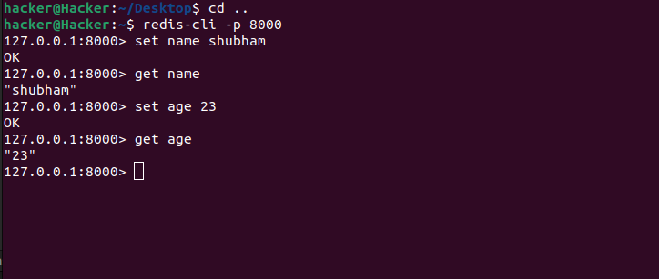

# Custom Redis-CLI

# Redis:
Redis is an open source in-memory data store that works really well as a cache or message broker, but it can also be used as a database when you don’t need all the features of a traditional database. It offers excellent performance, with the ability to quickly read and write data to memory. Additionally, Redis supports atomic operations, making it ideal for caching scenarios where you need fast access time.

## Project Details:
In this project i have created small redis server. I have create only two module of command SET and GET. 

SET command is used to set a key to hold a string value. for example
```javascript
SET mykey "Hello"

// here the key is mykey
// and value is "Hello"
````
and The GET command is used to retrieve the value of a key. The syntax is :
```javascript
GET mykey

// ans is "Hello"
````

## Code Explanation:


1.Imports: The code begins by importing necessary modules from Node.js.

```javascript
const net = require("net");
const Parser = require("redis-parser");
```
2.Global Variables:
```javascript
const store = {};
```
store: This object serves as a simple in-memory key-value store to mimic Redis functionality.

3.Creating Server:
```javascript
const server = net.createServer(connection => {
    console.log("Client Connected...");
```
net.createServer(): This function creates a new TCP server. It takes a callback function that will be invoked each time a new connection is established. In this callback function, "Client Connected..." is logged to the console.

4.Handling Data:
```javascript
connection.on('data', data => {
    const parser = new Parser({
        returnReply: (reply) => {
            const command = reply[0];
            switch (command){
                case 'set': {
                    const key = reply[1];
                    const value = reply[2];
                    store[key] = value;
                    connection.write('+OK\r\n');
                }
                break;

                case 'get': {
                    const key = reply[1];
                    const value = store[key];
                    if(!value) connection.write('$-1\r\n');
                    else {
                        connection.write(`$${value.length}\r\n${value}\r\n`);
                    }
                }
            }
        },
        returnError: (err) => {
            console.log('=>', err);
        }
    });
    parser.execute(data);
});
```
connection.on('data', callback): This event listener is triggered whenever data is received from the client. It takes a callback function to handle the received data.

Parser: It's an instance of the redis-parser module. It's used to parse Redis protocol messages.
The returnReply function handles incoming Redis commands. In this case, it supports set and get commands.

For set command, it extracts the key and value from the reply, stores them in the store object, and sends back a success message (+OK\r\n).

For get command, it retrieves the value associated with the key from the store object and sends it back to the client. If the key doesn't exist, it sends '$-1\r\n' as per the Redis protocol.

5.Server Listening:
```javascript
server.listen(8000, () => console.log(`Custom Redis server running on Port 8000`));
```
server.listen(): This method binds the server to a specified port (8000 in this case) and starts listening for connections. Once the server is running, it logs a message to the console.

## Result:



